# YourTube
YourTube is the home of YouTube channel reviews. With over 100 hours of content uploaded to YouTube a minute, we all know how difficult it can be to know who to watch next. That's where YourTube comes in; being home to a community's opinions, thoughts, and comments on everyones favourite channels, there's no way you'll be stuck on what to watch next again. It was created and developed by Lyle Kilbey as part of Code Institute's Web App Development Qualification.

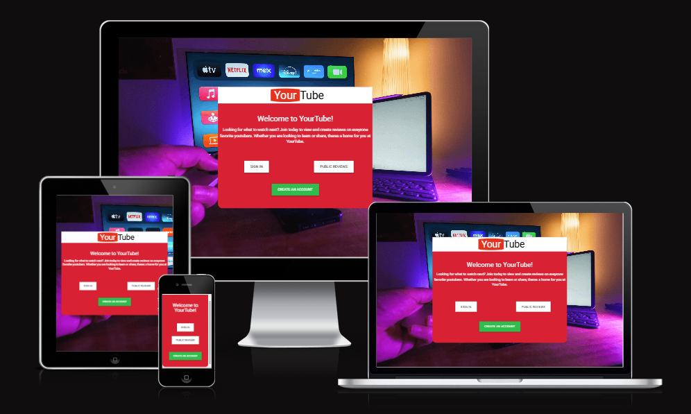

# UX
## Project Goals
YourTube aims to provide the YouTube community with a place to share reviews on YouTube channels. Using these reviews, YourTube creates a one-stop shop for getting recommendations on what to watch your YouTube algorithm would never show you.
## External user's goal
 - Get recommendations on what channels other YouTube consumers enjoy
 - Share your recommendations for youtube channels
## Site owner goal
- Increase site traffic to sell advertisement space
## User Stories
This section will outline the user scenarios, which will be addressed within the feature set of YourTube. 
1. As a user, I would like to create reviews
2. As a user, I would like to be able to delete my reviews
3. As a user, I would like to be able to edit my reviews
4. As a user, I would like to be able to sign in
5. As a user, I would like it so only I can edit my reviews
6. As a user, I would like to be able to see other people's reviews
7. As a user, I would like to be able to sign out
8. As a user, I would like to be able to see only the reviews I have created
9. As a user, I would like to be able to see reviews without having to sign in
10. As a user, I would like a quick way of accessing a reviewed channel
# Design and Wireframes
## Colours
The colour scheme for YourTube will be as follows:
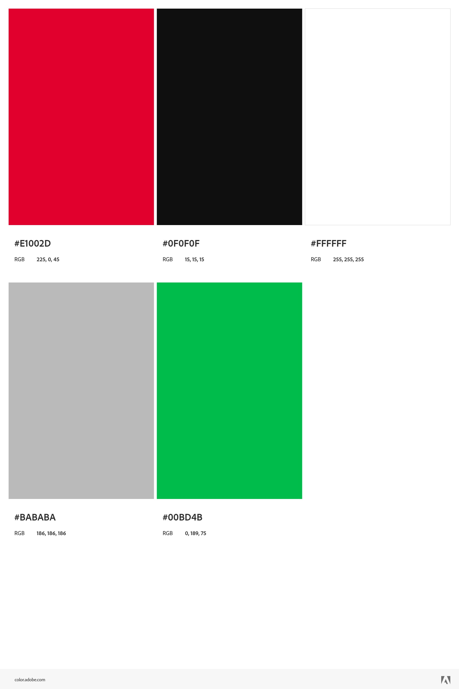
This scheme has been chosen to add a feeling of familiarity with our target audience of YouTube users. It reflects the signature YouTube red and the neutral supporting colours used within YouTube. The addition of the green Colour within YourTube allows for design choices that highlight users' action buttons. 
### Background Text Contrast
The table below shows all of the eligible colours, from within the colour scheme, that can be used when another colour has been set to the background. This has been verfied using [Webaim](https://webaim.org/resources/contrastchecker/).
|Background Colour|Eligible Text Colours|
|-|-|
|**Black** #0F0F0F|White, Grey, Green|
|**Red** #E1002D|White|
|**White** #FFFFFF|Red, Black|
|**Grey** #BABABA|Black|
|**Green** #00BD4B|Black|

## Screens
YourTube consists of 4 main screens. This section will detail what these screen contain.
### Feed
This is the public feed for all users of YourTube, signed in or not. It contains a list of all Reviews that have been marked for the public by their creators. If a a user is signed in, for reviews they have created, they should be able to navigate to the edit review screen. 
### Your Reviews
This is where a user can see reviews thay have created. They should not see reviews that have been created by other users here. It also contains the option to go to the create review and edit review screens.
### Edit Review
This screen allows the user to change details of a pre-existing review; when loaded, it should be preloaded with the data for the review, which was used to action the loading of this screen. Any changes made can be saved or discarded using the Update or Cancel button respectively. 
### Create Review
This screen allows users to create a new review, it should have any preloaded information. A user should be able to leave this screen with or without svaing a review. 
## Wireframes
### Mobile Devices
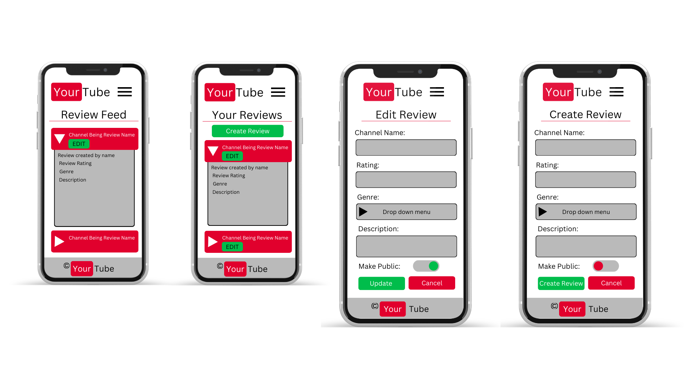
### Tablet Devices
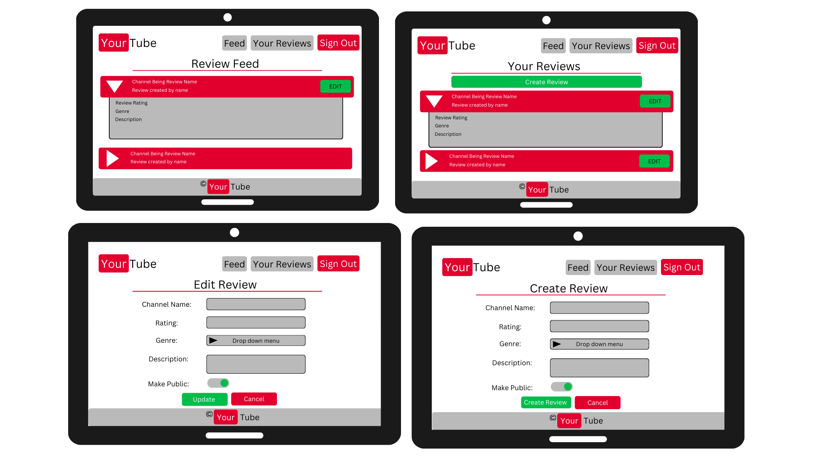
### Desktop Devices
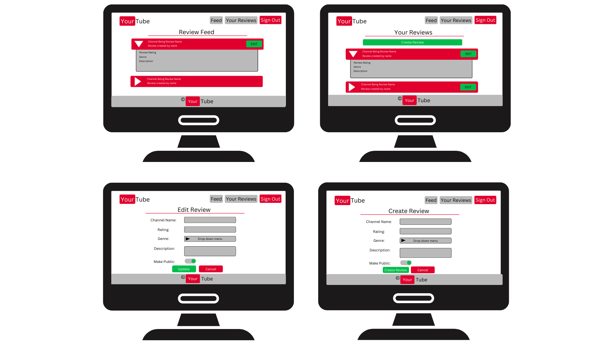
## Navigation Elements
The navigation elements present to a user will change depending on whether they are signed in. The below lists explain what navigation elements will be present based on the current user's sign in status. 
### User not signed in
- Feed
- Sign in
### User  signed in
- Feed
- Your Reviews
- Sign Out
# Data Schema
This project is using MongoDB as its database technology. This section will outline the databases avaiable within this projects collection.

## users

|Field Name|Data Types|
|-|-|
|username|string|
|password|string|

## reviews

|Field Name|Data Types|
|-|-|
|channel_name|string|
|channel_link|string|
|rating|int|
|genre|string|
|description|string|
|is_public|bool|
|created_by|string|
|date_created|string (DD/MM/YY)|

# User Story Implementation Evidence
1. As a user, I would like to create reviews
This was achieved by using a form which gets submitted as a POST request to the Flash app. The Flask app then processes the submitted data and add to the mongo database "reviews". The create a review button is held within the 'your reviews' page, which is only presented to users whom are signed in, meaning only registered users can create a review.
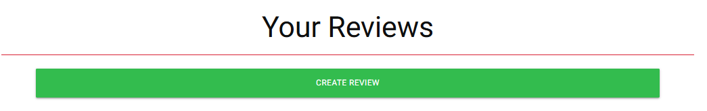
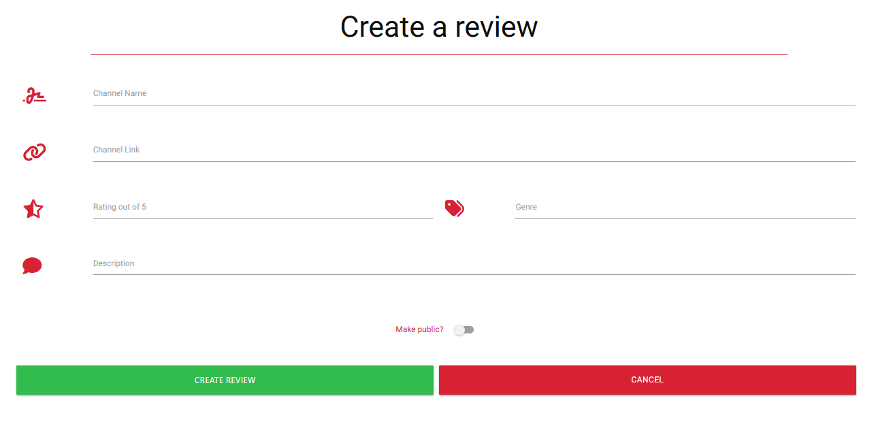
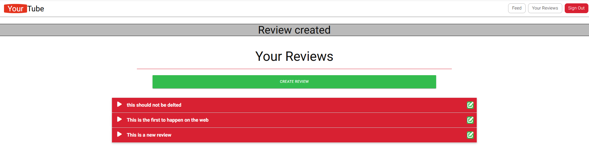

2. As a user, I would like to be able to delete my reviews
Deleting a review has been implimented by adding an addition button within the edit review screen. It asks the user to comfirm they are happy to delete the review.
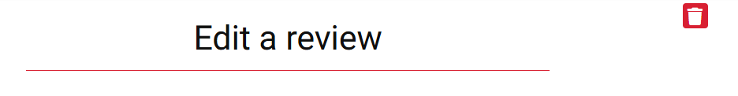
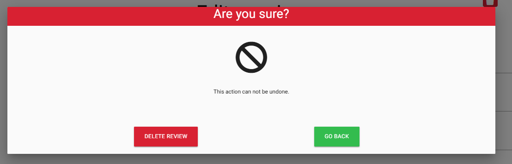
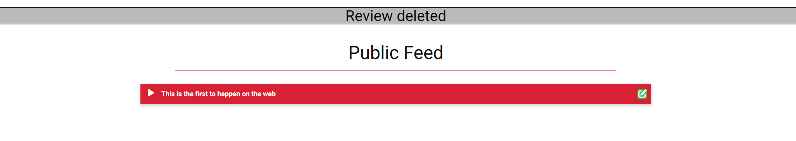

3. As a user, I would like to be able to edit my reviews
Users can see an edit button on all reviews which they created. They can view this button anywhere a review is displayed. Clicking the edit button presents the review form which can then be edited. The edit form comes prefilled with all data regarding the review at time of loading. 
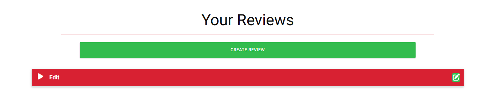
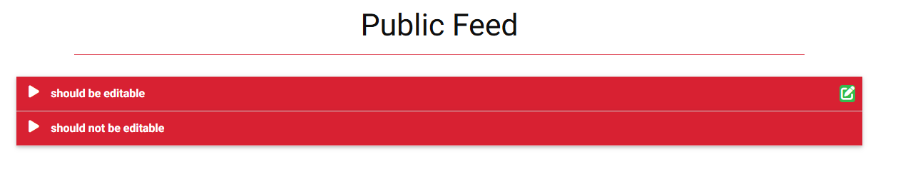
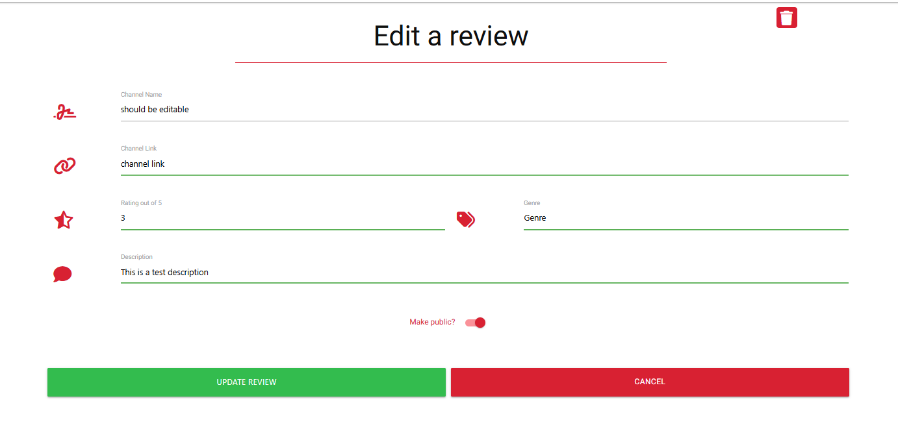
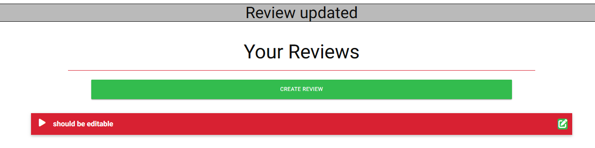

4. As a user, I would like to be able to sign in
This has been achieved by adding a sign-in page, which can be accessed from the public feed or the welcome page. It askes the user to provide their username and password. It will not sign in a user in if either there password or username does not match what is stored in mongoDB. 
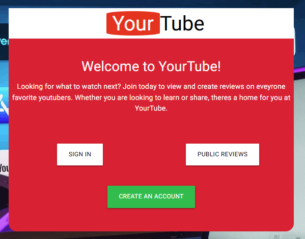
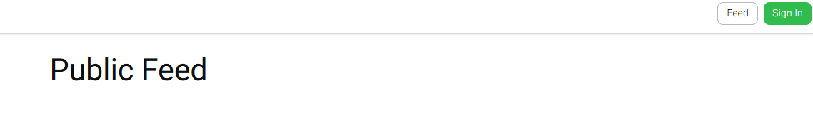
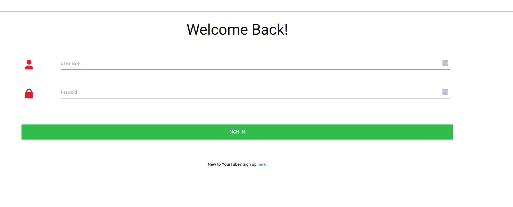
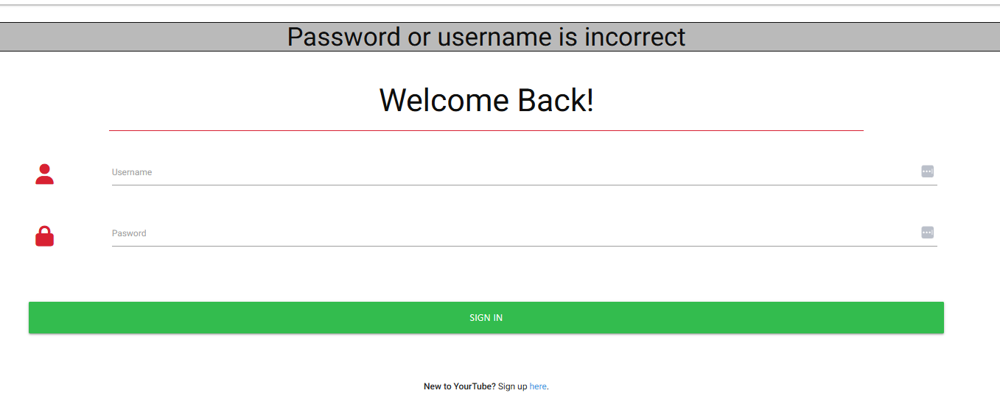
5. As a user, I would like it so only I can edit my reviews
This has been achieved by limiting the edit button to only viewable to the user who created it. 
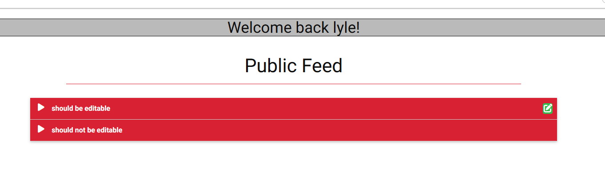
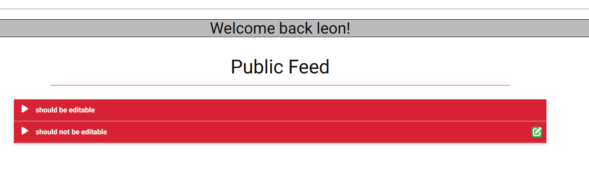
6. As a user, I would like to be able to see other people's reviews
A public feed was added to the app, showing all reviews marked as should be shown public. 

7. As a user, I would like to be able to sign out
A sign-out button has been added to the app, which redirects users to the Welcome page. In addition to clearing the session cookie. The sign-out button was added to the nav bar, making it accessible in all app areas. 
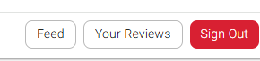

8. As a user, I would like to be able to see only the reviews I have created
The app has a 'your Reviews' section that filters for only reviews created by the currently logged-in user. 
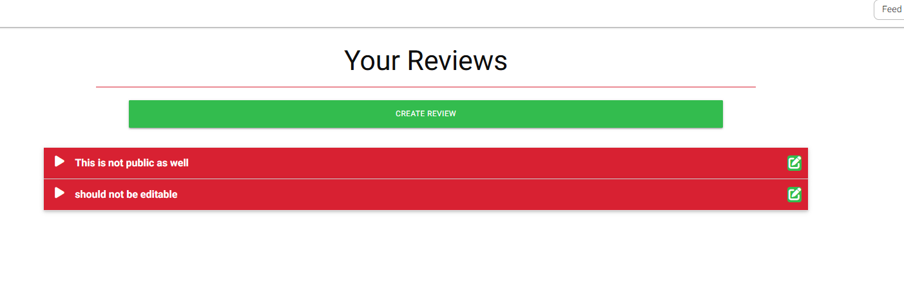
9. As a user, I would like to be able to see reviews without having to sign in
A public feed is accessible to all users (registered or not) and can be access via the welcome page. 
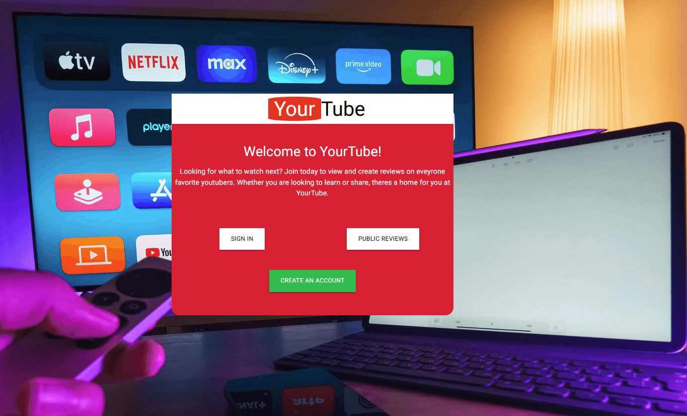
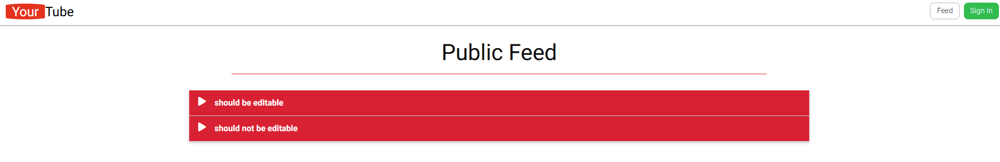
10. As a user, I would like a quick way of accessing a reviewed channel
A reviewer is able to add the link to a channel while submitting a review. When done yourTube will then present the channel name as link on both the public feed and your feed screens. 
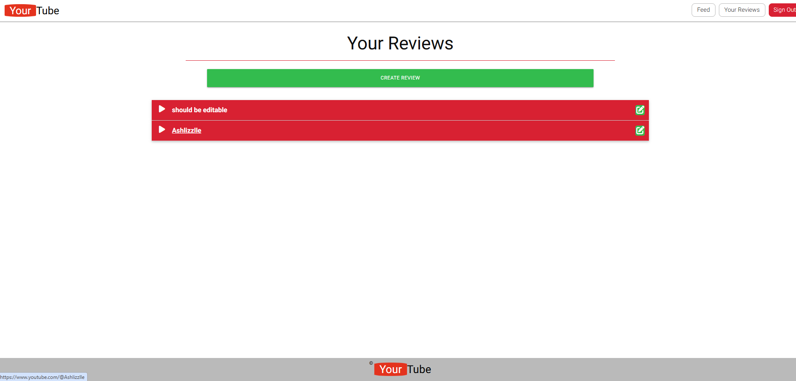
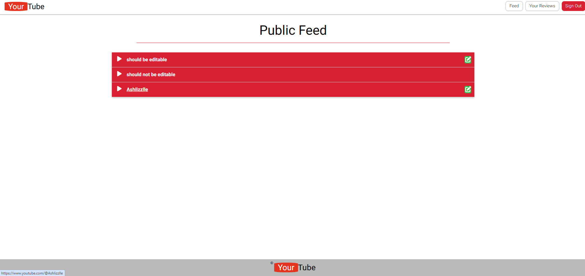
# Technologies Used
- HTML - To create a basic site
- CSS - To create a nice, standout front-end and to give a great user experience
- Materialize - Frontend framework  
- Jquery - Required for Materialize framework
- Canva - To create a wireframes
- Python - For backend functionality
- MongoDB - For database functionality
# Testing
Manual Testing and Validator Testing will be used to help ensure quality of YourTube. More information can be found here [testing.md](testing.md)
# Deployment
This app will be deployed using Heroku. The steps listed below detail the steps taken to deploy using the Heroku service. 
1. Created requirements file
2. Created Procfile
3. Created app in Heroku UI
4. Connected Github repo to Heroku
5. Added config vars in Heroku UI
6. Manually deploy app
7. Enabled automatic deployment

# Credits
- Logo CSS styling
    - Link: : https://dev.to/rembertdesigns/youtube-logo-pure-css-2268 
    - Changes made: removed content over write in css to display your text. This happened in addtion to font size changes.
- Welcome Image
    - Link: https://www.pexels.com/photo/home-entertainment-setup-with-streaming-services-30366457/
    - Used as background image for welcome page
