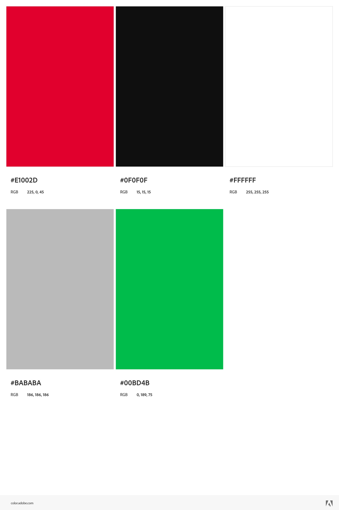
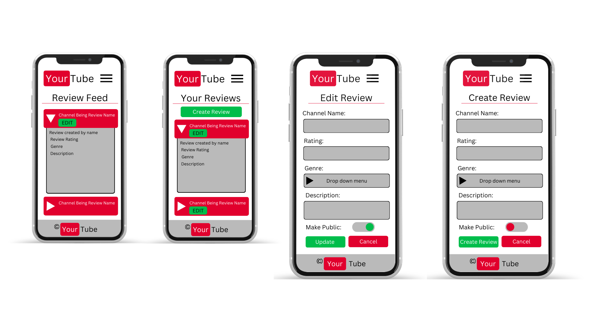
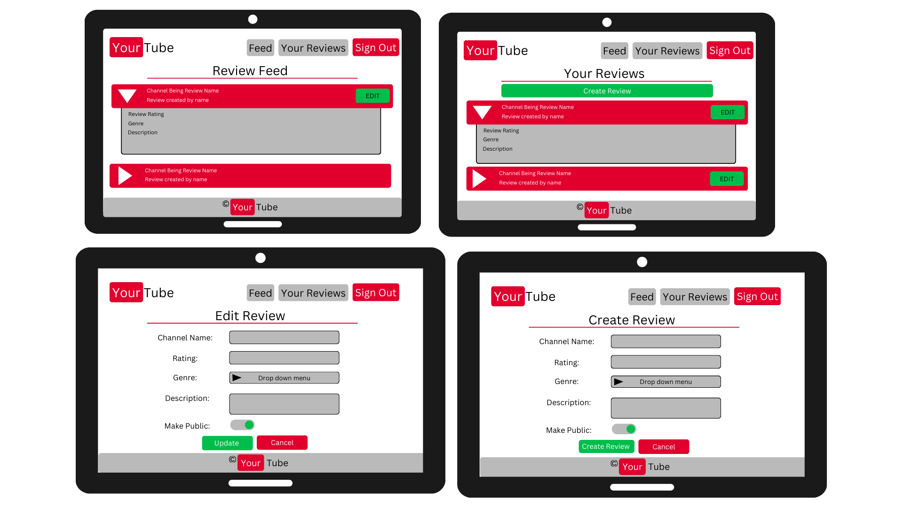
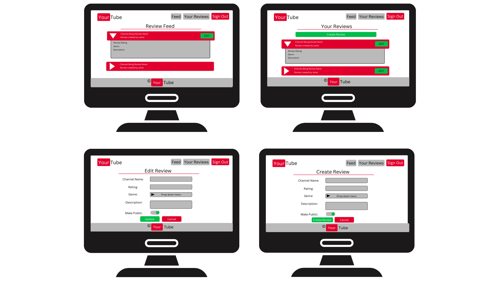

# YourTube
YourTube is the home of YouTube channel reviews. With over 100 hours of content uploaded to YouTube a minute, we all know how difficult it can be to know who to watch next. That's where YourTube comes in; being home to a community's opinions, thoughts, and comments on everyones favourite channels, there's no way you'll be stuck on what to watch next again. It was created and developed by Lyle Kilbey as part of Code Institute's Web App Development Qualification.

**Insert Responsive UI Mock-Up here**

# UX
## Project Goals
YourTube aims to provide the YouTube community with a place to share reviews on YouTube channels. Using these reviews, YourTube creates a one-stop shop for getting recommendations on what to watch your YouTube algorithm would never show you.
## External user's goal
 - Get recommendations on what channels other youtube consumers enjoy
 - Share your recommendations for youtube channels
## Site owner goal
- Increase site traffic to sell advertisement space
## User Stories
This section will outline the user scenarios, which will be addressed within the feature set of YourTube. 
- As a user, I would like to create reviews
- As a user, I would like to be able to delete my reviews
- As a user, I would like to be able to edit my reviews
- As a user, I would like to be able to sign in
- As a user, I would like it so only I can edit my reviews
- As a user, I would like to be able to see other people's reviews
- As a user, I would like to be able to sign out
- As a user, I would like to be able to see only the reviews I have created
- As a user, I would like to be able to see reviews without having to sign in
- As a user, I would like a quick way of accessing a reviewed channel
# Design and Wireframes
## Colours
The color scheme for YourTube will be as follows:

This scheme has been chosen to add a feeling of familiarity with our target audience of YouTube users. It reflects the signature YouTube red and the neutral supporting colours used within YouTube. The addition of the green Colour within YourTube allows for design choices that highlight users' action buttons. 
### Background Text Contrast
The table below shows all of the eligible colours, from within the colour scheme, that can be used when another colour has been set to the background. This has been verfied using [Webaim](https://webaim.org/resources/contrastchecker/).
|Background Colour|Eligible Text Colours|
|-|-|
|**Black** #0F0F0F|White, Grey, Green|
|**Red** #E1002D|White|
|**White** #FFFFFF|Red, Black|
|**Grey** #BABABA|Black|
|**Green** #00BD4B|Black|
## Screens
YourTube consists of 4 main screens. This section will detail what these screen contain.
### Feed
This is the public feed for all users of YourTube, signed in or not. It contains a list of all Reviews that have been marked for the public by their creators. If a a user is signed in, for reviews they have created, they should be able to navigate to the edit review screen. 
### Your Reviews
This is where a user can see reviews thay have created. They should not see reviews that have been created by other users here. It also contains the option to go to the create review and edit review screens.
### Edit Review
This screen allows the user to change details of a pre-existing review; when loaded, it should be preloaded with the data for the review, which was used to action the loading of this screen. Any changes made can be saved or discarded using the Update or Cancel button respectively. 
### Create Review
This screen allows users to create a new review, it should have any preloaded information. A user should be able to leave this screen with or without svaing a review. 
## Wireframes
### Mobile Devices

### Tablet Devices

### Desktop Devices

## Navigation Elements
The navigation elements present to a user will change depending on whether they are signed in. The below lists explain what navigation elements will be present based on the current user's sign in status. 
### User not signed in
- Feed
- Sign in
### User  signed in
- Feed
- Your Reviews
- Sign Out
# User Story Implementation Evidence
**Fill this out later**
# Technologies Used
- HTML - To create a basic site
- CSS - To create a nice, standout front-end and to give a great user experience
- Materialize - Frontend framework  
- Jquery - Required for Materialize framework
- Canva - To create a wireframes
- Python - For backend functionality
- MongoDB - For database functionality
# Testing
Manual Testing and Validator Testing will be used to help ensure quality of YourTube. More information can be found here [testing.md](testing.md)
# Deployment
**Fill this out later**
# Credits
https://dev.to/rembertdesigns/youtube-logo-pure-css-2268 - LOGO
