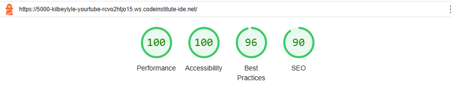
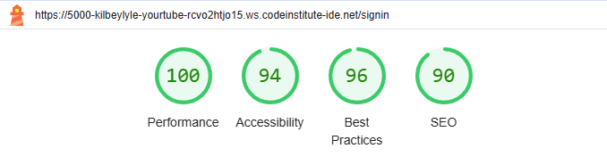
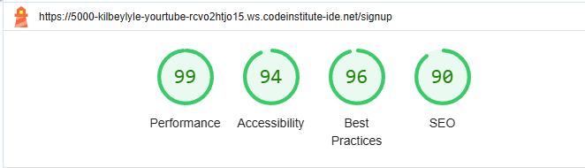
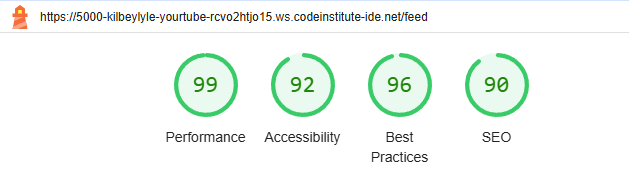
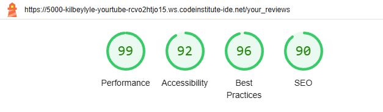
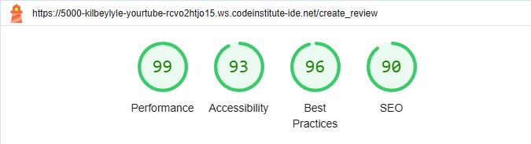
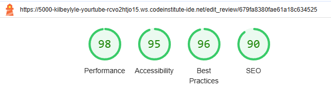
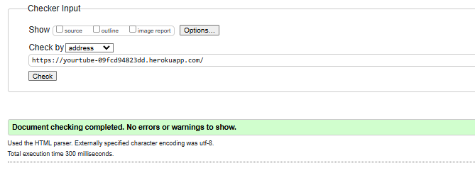

fixed sign in and out button bg color

is public status was setting to null - added tenery if stament to fix this before creating document

not all reviews wqith status of publick showing on feed - this was because of editing rveiew was setting is pubklic back to null fixed by adding missed removal of get is pbulic from form rathwer than variable 

missing description on edit screen added as value update to be enclosed within the tags

fixed is public toggle to set when editing, did this by adding an if else statment in tmeplate 

unable to click oon edit button, edit page does not open, added url for to feed template

manually typing in your reviews into search bar breaks app, same is true for edit, delete, create screen protection added ot all - check to make sure there is a user is session var

if review id is know any user is able to delete rveiew - fixed by adding a session user, created by check

Edit view always loaded as is public turned on - update edit review tmeplate to reflect change to booleon data type

unable to delete reviews - due to the fact I was calling .creaby by rather than calling the key value in [] < those things

## Lighthouse
### Welcome Page
After updating the 'Create a new account button text colour to black' below, results were achieved.

### Sign-in page
Once the wording for the link to our sign up form was changed from "New to YourTube? Sign-up here." to "New to YourTube? Go to our Sign-up form." to give a better description text; the following result was achieved.

### Sign-up page
Updating the message "Already got an account? Sign-in here." to "Already got an account? Visit the sign-in form." a result of the below was achieved.

### Public feed
With zero changes, the following result was given.

### Your Reviews
After no changes. The following result was given.

### Create review
After no changes, the following result was given.

### Edit Review
After adding aria-label="delete button" to delete button, following result were given.

## HTML Validation
### Welcome Page
No changes needed

### Sign-in page
After fixing incorrect closing tag for 'Welcome back' title and changing section elements to divs (as they did not container a header) The following results were given. 

### Sign-up page
After fixing the incorrect closing tag for the 'Welcome back' title and changing section elements to divs (as they did not container a header), The following result was given. 

### Public feed
After fixing incorrect closing tag for 'Welcome back' title and changing section elements to divs (as they did not container a header). In addition to removing leftover 'href' and 'target' attributes, from an anchor element, from a paragraph element. The following result were given. 

### Your Reviews
After fixing the incorrect closing tag for the 'Welcome back' title and changing section elements to divs (as they did not container a header), The following result was given. 

### Create review
After fixing the incorrect closing tag for the 'Welcome back' title and changing section elements to divs (as they did not container a header), The following result was given. 

### Edit Review
After fixing the incorrect closing tag for the 'Welcome back' title and changing section elements to divs (as they did not container a header). As well as removing a stray anchor tag. The following result was given.

### CSS valdator testing
With zero changes, the following results were given.

