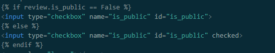

## Bugs
This section will outline all bugs found thoughtout the development cycle. It will detail each bug found and the approach taken to fix them.

1. **The sign-in and sign-out nav buttons did have the correct colouring.**
Each button was given an ID to be targeted in CSS. An ID was used as this will not be a repeating style and I wanted to use a selector with a higher Specificity. So that any other changes to happen to the broader nav-bttn class did not affect the colouring of the sign-in and sign-out buttons. 
 
CSS rules:  

 
HTML for main nav: 

 
HTML for side nav: D

2. **Is public status was being set to null in mongo when switch set to off in create/edit review form.**
To solve this I added ternary if stament before creating document sent to mongo. 
 

3. **Some reviews with an intended status of public were not showing on public feed.** 
This bug occured because editing a review was setting the is public field back to null. When setting up is public ternary statement from bug 2, the section where the document was create was still pulling the result from the the making the POST request rather than the is public variable. Updating the 'updated_review' document to have '"is_public":is_public' solved this error mode. 
 

4. **the description field was missing the review data when loading the edit screen.**
This failure occurred because the review data was trying to be loaded into the input field by a 'value' attribute. However, the description field is a textarea element, not an input. To solve this, the review data was passed into the field by including the jinja placeholder within the textarea tags. 
 

5. **When on the public feed screen, clicking edit button did not open edit review page.**
This occured due to a missing href within the feed.html template.
 

6. **User who were not signed in were still able to access restricted pages by manually typing url into search bar. This results in pages breaking and showing a flask error due to missing session cookie data.**
To solve this I defensively programmed try, except blocks into edit_review, your_reviews, create_reviews, delete_review functions.
 
edit_review:  

 
your_reviews:  

 
create_reviews:  

 
delete_review:  

7. **If review id is known any actor is able to delete a review**
This was solved by adding to the try, expect block for the delete_review function. This function now check if active user, in session cookie, matches the created_by for the review which is attmepting to be deleted.
 

8. **The edit review always loaded as is public check box in the on state**
This bug was caused by the Jinja template not referencing a string "on" or "off", a legacy checking when is_public was a hold string rather than a bool data type. To resolve failure state edit_review template was upsated to reflect change to booleon data type.
 

9. **Unable to delete reviews any review**
This bug was introudced during the fix for bug 7. It was cause by incorrectly accessing the created_by data. Oringally the code was attwempting to access this data using dot notation rather than indexing.
 

## Lighthouse
Using the Chrome Inbulit validator tool, I will validate each page's loading performance. This section will detail changes made and the result of testing after changes. 

### Welcome Page
After updating the 'Create a new account button text colour to black' below, results were achieved.

### Sign-in page
Once the wording for the link to our sign up form was changed from "New to YourTube? Sign-up here." to "New to YourTube? Go to our Sign-up form." to give a better description text; the following result was achieved.

### Sign-up page
Updating the message "Already got an account? Sign-in here." to "Already got an account? Visit the sign-in form." a result of the below was achieved.

### Public feed
With zero changes, the following result was given.

### Your Reviews
After no changes. The following result was given.

### Create review
After no changes, the following result was given.

### Edit Review
The following results were given after adding aria-label="delete button" to the delete button.

## HTML Validation
Using W3C's HTML checker, each page's HTML codebase will be checked for failures. This section will list any changes made and the end result of the testing. As you will see below, a consistant warning appears on all report (expect Welcome page) due to the use of Jinja templating. The section list does contain a header, which is wrapped in another div in order to have a targetable wrapper when applying CSS to the HTML page before rendering. 

### Welcome Page
No changes needed

### Sign-in page
The following results were given after fixing the incorrect closing tag for the 'Welcome back' title and changing section elements to divs (as they did not contain a header).

### Sign-up page
After fixing the incorrect closing tag for the 'Welcome back' title and changing section elements to divs (as they did not contain a header), The following result was given.
 

### Public feed
After fixing the incorrect closing tag for the 'Welcome back' title and changing section elements to divs (as they did Not contain a header). In addition to removing leftover 'href' and 'target' attributes from an anchor element from a paragraph element. The following results were given. 

The error shown cannot be found in the codebase. 

### Your Reviews
After fixing the incorrect closing tag for the 'Welcome back' title and changing section elements to divs (as they did not contain a header), The following result was given. 

### Create review
After fixing the incorrect closing tag for the 'Welcome back' title and changing section elements to divs (as they did not contain a header), The following result was given. 

### Edit Review
After fixing the incorrect closing tag for the 'Welcome back' title and changing section elements to divs (as they did not contain a header). As well as removing a stray anchor tag. The following result was given.

### CSS valdator testing
With zero changes, the following results were given.

The presented above is due to a non-custom imported style.